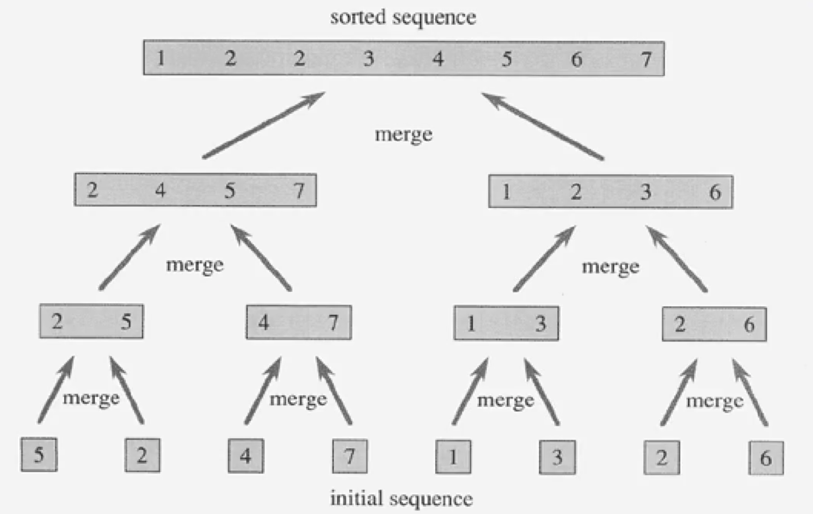

## 분할 정복

Merge Sort [선택 정렬]

>Logic
1. 배열을 최소 크기갇 될 때 까지 반으로 쪼갠다.
2. A 배열의 첫인덱스와 B 배열의 첫 인덱스를 비교하여 작은 값을 앞에 채운다.
3. 남은 큰 값은 다른 배열의 다음 인덱스와 또 비교해서 작은 값을 채운다.
4. 위 과정을 반복하며 A 와 B 배열을 합쳐나간다.
5. 나머지 쪼개진 배열도 병합해 나가고 같은 크기의 배열이 완성되면 같은 방법으로 원래 크기가 될 때까지 합쳐나간다.

>시간복잡도

O(NlogN) 
