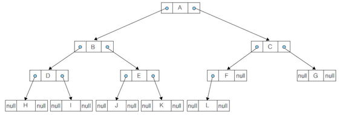

### Binary Tree(이진 트리)

> 속성
>
1. 각 노드는 하위의 왼쪽, 오른쪽 노드의 참조와 값을 가진다.
2. 최 하위 노드는 값만을 가진다.

>순회
>
트리의 자료를 계층 구조로서 저장하고, 사용하기 위하여 모든 데이터에 방문하는 방법이 필요하다. 

그 방법을 순회 라고한다.

>전위 순회 
>
최 하위 왼쪽 서브트리부터 방문하여 올라가면서 오른쪽 노드를 방문하는 알고리즘
>중위 순회

노드의 왼쪽 노드부터 올라오며 값을 확인.
올라가는 도중 오른쪽 노드 있는 노드를 만난다면 오른쪽 노드로 이동 후, 왼쪽 노드가 있나 확인 후
왼쪽 노드로 내려가서 다시 올라오면서 순회하는 알고리즘

>후위 순회
>
최 왼쪽 하단 노드부터 올라오며 조회, 오른쪽 노드가 있는 노드를 만나면
값을 확인 하지 않고, 오른쪽 하위 노드로 이동 후 그 노드도 하위 노드가 있다면, 값을 확인 하지 않고
왼쪽 노드부터 내려간 후 다시 올라오며 순회하는 알고리즘.
