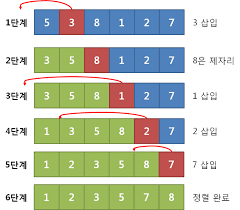

## 정렬

Insert Sort [삽입 정렬]

>Logic
1. key 1 부터 시작.
2. key 번째 원소와 그 앞 원소들의 값을 key-1번째 부터 차례로 비교  
3. key 원소보다 큰 값이 나올 시 빈 공간을 두고 한칸씩 뒤로 밈
4. key 원소보다 작은 값이 나올 시 비교를 종료하며 그자리 key 원소를 삽입
5. N번 반복

>시간복잡도

O(N^2) 

최대 : N^2 (역정렬일 경우)

최선 : N